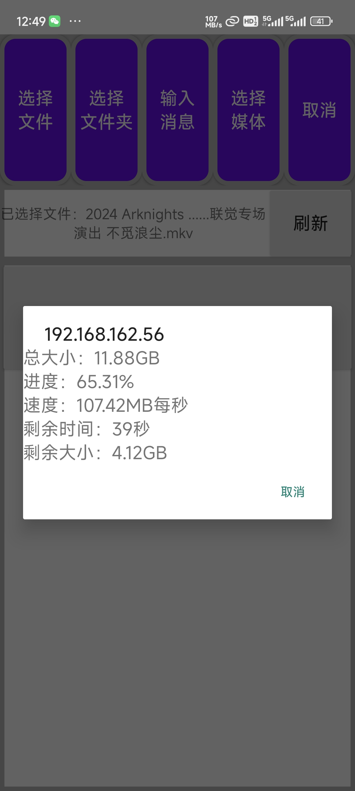
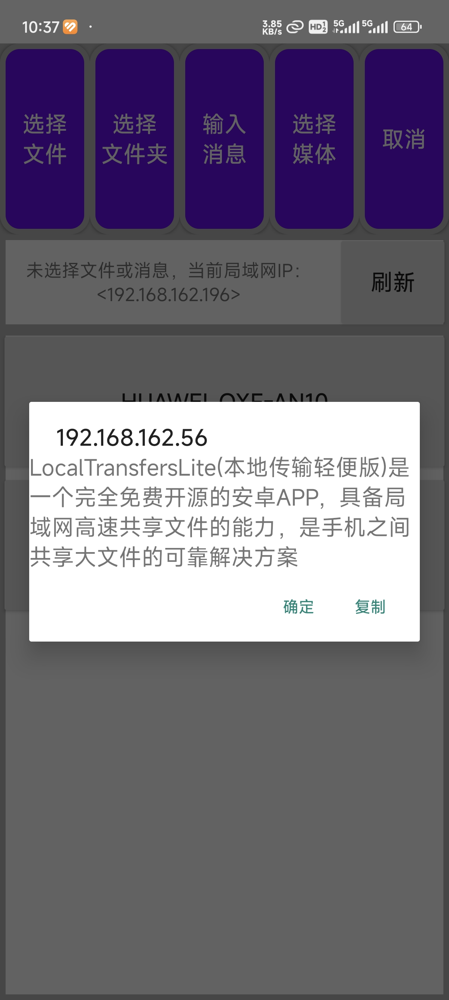

# LocalTransfersLite
***
## 本地传输轻便版
LocalTransfersLite(本地传输轻便版)是一个完全免费开源的安卓APP，具备局域网高速共享文件的能力，是手机之间共享大文件的可靠解决方案
***
### 软件特点
1. 传输速度快
    * 实测使用手机热点直接连接两部手机时最高速度约110MB/S
    * 可作为手机数据备份，转移的高速传输工具
2. 自动识别
    * 当两部或多部手机处于同一局域网内时打开软件，软件之间将自动识别并建立连接
    * 正常网络情况下多个软件间的相互识别速度基本不超过2秒
3. 轻便
    * 软件大小小于5MB，界面简洁明了
4. 隐私保护
    * 软件代码100%开源
    * 不该获取的权限绝对不获取
    * 不该读取的文件绝对不读取
    * 所有数据仅在局域网内传输不对外发送(请用户自行保证局域网安全，如果无法保证，可以直接使用手机热点连接)
### 软件截图

### 软件细节
* 在其他app(如相册)分享的文件可以被本应用接收并发送给其他设备
* 在微信、qq等其他软件点击一个文件选择使用其他应用打开时，也可以选择本应用，应用会接收文件并且可以发送给其他设备
* 由于数据仅在局域网中发送，所以即使开热点也不消耗流量
* 安卓10及以下安卓版本需授予储存权限，如果未授予将保存在应用目录下
* 安卓13及以上尽量授权通知权限，以保证前台服务正常创建，提高后台和熄屏传输的稳定性
* 应用默认文件保存目录/Download/LocalTransfersLite
* 安卓10及以下安卓版本未授权储存权限时将保存在/Android/data/com.ameana.localtransferslite/files/Download
### 软件网络协议及其对应端口号
| 协议 | 端口 | 注意事项 |
|-----|-----|-----|
| TCP | 14138 | 如果端口被占用则会随机一个端口 |
| UDP | 27028 | 端口号固定，请保证端口不被其他应用占用 |
### 其他说明
* 由于时间原因暂未编写电脑版，暂时不能与电脑互传
* 目前软件已经适配安卓6到安卓14，后续如果安卓更新安卓15及以上版本，不能保证不会出现问题
* 软件可以跑满局域网带宽，但如果局域网本身带宽很慢，则会严重影响传输速度，这种情况下推荐使用热点直连
* 软件数据是明文传输，没有加密，请确保当前局域网可信，请勿在公共网络下传输数据，避免隐私泄露，没有安全的局域网就直接使用手机热点
* 由于平时时间有限，除非出现重大bug，否则几乎不更新，除非软件使用人数很多或以后有时间，如果出现小问题或想增加功能，可以克隆项目或申请拉取分支(注意不要违反开源协议)
### 本项目所有开源平台地址
| 平台名称 | 访问地址 |
|-----|-----|
| GitHub | [点此访问](https://github.com/Ameana-FFF/LocalTransfersLite) |
| Gitee | [点此访问](https://gitee.com/Ameana-FFF/LocalTransfersLite) |
